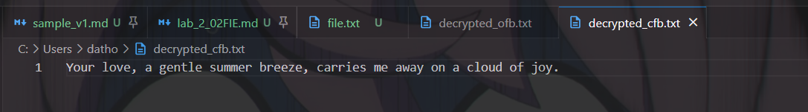
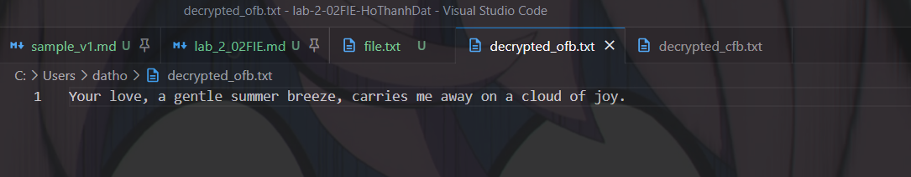
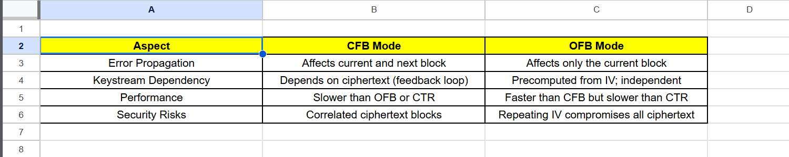
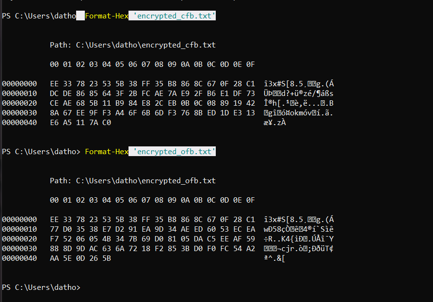
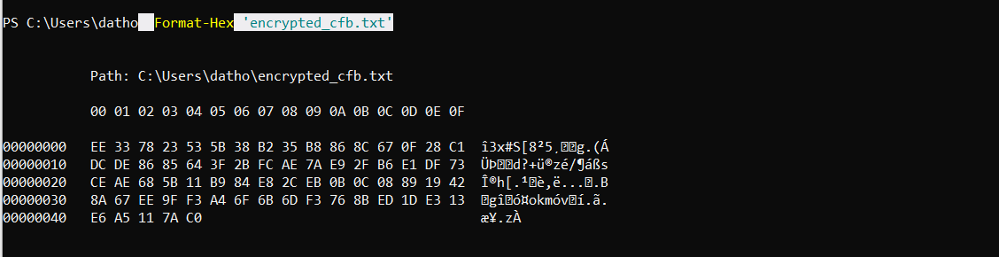
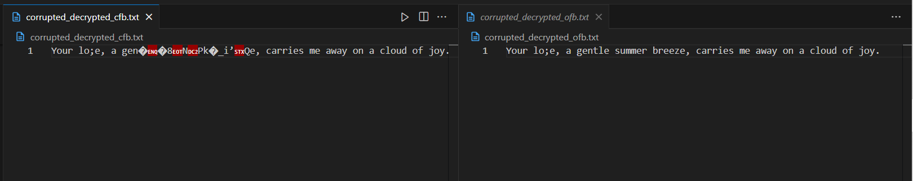

# Lab #2,22110020, Ho Thanh Dat, INSE331280E_02FIE
# Task 1: Public-key based authentication
This lab implements public-key based authentication step-by-step with openssl


**Question 1**:

**Answer 1**:
## Step 1. Create a text file named `file.txt`:
*First, we write a 56 bytes long message and save it in a text file with a content, for example:*<br>

```sh
Your love, a gentle summer breeze, carries me away on a cloud of joy.
```

## Step 2: Use OpenSSL to encrypt the file
*I will use the following command in terminal to encrypt the message with AES-256-CFB:*<br>

```sh
openssl enc -aes-256-cfb -in file.txt -out encrypted_cfb.txt -K <key> -iv <iv>
```
In this case, I will replace <key> with my 64-char hex key and <iv> with a 32-char hex IV which are:

```sh
e3b0c44298fc1c149afbf4c8996fb92427ae41e4649b934ca495991b7852b855
```

```sh
0123456789abcdef0123456789abcdef
```
*I will use the following command in terminal to encrypt the message with  with OFB mode:*<br>

```sh
openssl enc -aes-256-ofb -in file.txt -out encrypted_ofb.txt -K e3b0c44298fc1c149afbf4c8996fb92427ae41e4649b934ca495991b7852b855 -iv 0123456789abcdef0123456789abcdef
```


*Use the PowerShell built-in function Format-Hex to see the content file*<br>

```sh
$ Format-Hex '.\your-file-name'
```


Cyphertext can clearly be seen in the screenshot.

## Step 3: Decrypt and verify

*Now, I will decrypt the encrypted file to verify its correctness by using following command:*<br>

```sh
openssl enc -aes-256-cfb -d -in encrypted_cfb.txt -out decrypted_cfb.txt -K e3b0c44298fc1c149afbf4c8996fb92427ae41e4649b934ca495991b7852b855 -iv 0123456789abcdef0123456789abcdef
```
For OFB:

```sh
openssl enc -aes-256-ofb -d -in encrypted_ofb.txt -out decrypted_ofb.txt -K e3b0c44298fc1c149afbf4c8996fb92427ae41e4649b934ca495991b7852b855 -iv 0123456789abcdef0123456789abcdef
```
*The two below image show that the decrypted files (decrypted_cfb.txt and decrypted_ofb.txt) match the original file.txt.*<br>






The origin content can be seen after decryption in the screenshot.

## Step 4: Analyze the modes

*The image below compare the two encryption modes:*<br>



### 1. Error Propagation:
CFB: Errors in the ciphertext can propagate to multiple plaintext blocks. This is because the decryption process depends on the previous ciphertext blocks.
OFB: Errors in the ciphertext only affect the corresponding plaintext block. This is because the keystream is generated independently for each block.

### 2. Keystream Dependency:
CFB: The keystream generation depends on the previous ciphertext block. This creates a feedback loop that can affect the overall encryption process.
OFB: The keystream is generated independently for each block, making it less susceptible to errors or attacks that target the keystream.

### 3. Performance:
CFB: Generally slower than OFB and CTR modes due to the feedback loop and the need to process previous ciphertext blocks.
OFB: Faster than CFB but slower than CTR mode.

### 4. Security Risks:
CFB: Correlated ciphertext blocks can potentially lead to security vulnerabilities if the attacker can exploit these correlations.
OFB: Reusing the initialization vector (IV) can compromise the security of the encryption, as it can lead to identical keystreams for different messages.

**Question 2**

**Answer 2**

## Step 1: Modify the 8th byte of the encrypted files

*In this step, I will use a simple python script to modify the 8th byte of the encrypted files*<br>

```sh
def modify_byte(file_path, byte_index, new_byte_value):
    with open(file_path, "r+b") as f:
        f.seek(byte_index)
        f.write(bytes([new_byte_value]))  # Modify the byte
```
*Use the PowerShell built-in function Format-Hex to see if the 8th byte had been modified*<br>

```sh
$ Format-Hex '.\your-file-name'
```





As you can see, the 8th byte had been modified from B2 to FF in the image given

## Step 3: Decrypt the corrupted files

*In this step, I will Decrypt the corrupted files with OpenSSL*<br>

Decrypt the corrupted CFB file:

```sh
openssl enc -aes-256-cfb -d -in encrypted_cfb.txt -out corrupted_decrypted_cfb.txt -K e3b0c44298fc1c149afbf4c8996fb92427ae41e4649b934ca495991b7852b855 -iv 0123456789abcdef0123456789abcdef
```
Decrypt the corrupted OFB file:

```sh
openssl enc -aes-256-ofb -d -in encrypted_ofb.txt -out corrupted_decrypted_ofb.txt -K e3b0c44298fc1c149afbf4c8996fb92427ae41e4649b934ca495991b7852b855 -iv 0123456789abcdef0123456789abcdef
```



As you can see from the image, it has been modified a bit compared to origin message which is

```sh
Your love, a gentle summer breeze, carries me away on a cloud of joy.
```
### Evaluate the outcomes
1. For CFB:
The 8th byte's corruption affects the decryption of the corresponding plaintext block and propagates to the next block.
The error stops after the next block due to the feedback mechanism being reset with correct ciphertext.
2. For OFB:
The 8th byte's corruption affects only the corresponding plaintext block.
Subsequent blocks remain unaffected because the keystream is independent of the ciphertext.

# Task 2. Encryption Mode – ECB vs. CBC
This lab compares the behaviour of ECB and CBC encryption modes
**Question 1**: Exploration of various ECB & CBC  with openssl
**Answer 1**:
## 1. Download the bitmap file `origin.bmp`.


## 2. Split the file into header and body:

```sh
dd if=origin.bmp of=header.bin bs=1 count=54
dd if=origin.bmp of=body.bin bs=1 skip=54
```

<br>


## 3. Encrypt the body using CBC mode:

<span>*I reused the KEY and IV values from the first task, just to make sure the consistency.*</span><br>

```sh
openssl enc -aes-256-cbc -nosalt -in body.bin -out encrypted_body.bin -K 00112233445566778899AABBCCDDEEFF00112233445566778899AABBCCDDEEFF -iv 0102030405060708090A0B0C0D0E0F10
```

<span>*After using the `cat` command to look at the `encrypted_body.bin`, we can see it was fully encrypted.*</span><br>

<br>

## 4. Combine the header and encrypted body:

```sh
cat header.bin encrypted_body.bin > partially_encrypted.bmp
```

<br>